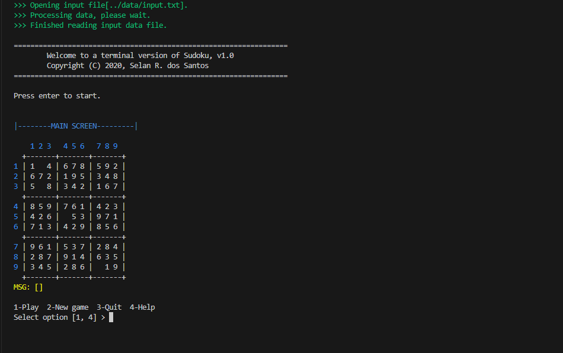
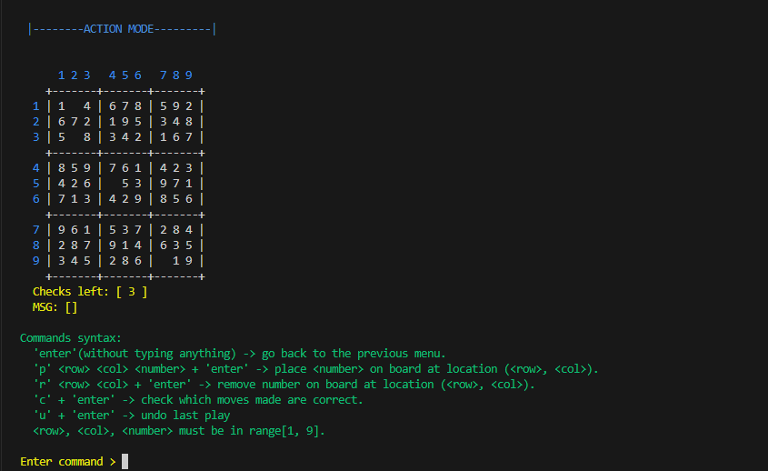
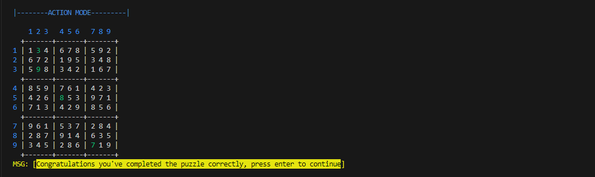

# Intro

This project implements a terminal version of the Sudoku game.

The **full description** of the project may be found [**here**](docs/sudoku_interativo.pdf).

# The game

According to the [wikipedia](https://en.wikipedia.org/wiki/Sudoku):

> Sudoku is a logic-based, combinatorial number-placement puzzle.
> The objective is to fill a 9×9 grid with digits so that each column, each row, and each of the nine 3×3 subgrids that compose the grid (also called "boxes", "blocks", or "regions") contain all of the digits from 1 to 9.
> The puzzle setter provides a partially completed grid, which for a well-posed puzzle has a single solution.

The Sudoku rules are:

1. Each row, column, and nonet can contain each number (typically 1 to 9) exactly once.
2. The sum of all numbers in any nonet, row, or column must be equal to 45.

# Input

A ascii file with puzzles, as the one available in [`data/input.txt`](data/input.txt).


# Compilation and Running

Some Orientatios about how to compile and run this project:
  1. You'll need to have ``G++`` compiler and ``Cmake`` installed and up to date.
  2. You have to create a folder ``build`` within the ``source`` folder.
  3. You have to execute the command  ``cmake ..`` within the ``build`` folder, as the ``CMakeLists.txt`` file should be in the parent folder of the current one.
  4. You have to execute the command ``make`` within the 'build' folder.
  5.  You have to execute the command ``./build/sudoku`` within ``source`` folder due to the way the project has been organized.
  6.  Portuguese version [`cmake.txt`](docs/cmake.txt).
  
# Usage

```
% ./sudoku --help
Usage: sudoku [-c <num>] [-h] <input_cfg_file>
  Game options:
    -c  <num> Number of checks per game. Default = 3.
    -h        Print this help text.
```

# Images

## Main Screen


## Gameplay Screen


## Winner Screen


# Features

The game offers:

+ colored output.
+ indication of _invalid_ plays, i.e. plays that breaks the Sudoku's basic rules.
+ a simple interface.
+ undo actions.
+ limited possibility of checking if a move is correct or not.

# Author

UFRN/DIMAp, copyright 2020.

Selan R. dos Santos

# Implementation authors

+ Pedro Henrique Sales dos Santos
+ Igor Rauan Soares da Silva
